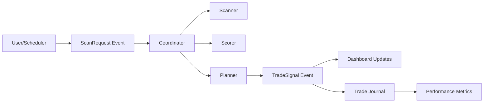

# One-Day Trading Agent (ODTA)

## Badges

[](https://github.com/monirul-islam-47/fin_agent_v0_050625/actions)
[](https://github.com/monirul-islam-47/fin_agent_v0_050625/actions)
[](https://github.com/monirul-islam-47/fin_agent_v0_050625/actions)
[](https://www.python.org/downloads/release/python-3110/)
[](https://github.com/psf/black)
[](https://opensource.org/licenses/MIT)

A sophisticated Python trading assistant that identifies 5 US stocks daily with 7-10% intraday profit potential. Built for retail traders using Revolut with a €500 bankroll, operating entirely on free-tier APIs.

## 🎯 Key Features

- **Smart Stock Screening**: AI-powered gap detection (>4%) with multi-factor scoring
- **Real-time Data**: WebSocket streaming via Finnhub with automatic fallback
- **Risk Management**: Enforced €33 daily loss cap, €250 position limits, 3:1 R/R targets
- **Interactive Dashboard**: Streamlit UI with live prices, charts, and manual controls
- **Event-Driven Architecture**: Async pub/sub system for real-time updates
- **Automated Scanning**: Scheduled scans at 14:00 and 18:15 CET
- **Free-Tier Optimization**: Intelligent quota management across multiple APIs
- **Trade Persistence**: Automatic recording of all trades with SQLite storage
- **Performance Analytics**: Real-time metrics, win rate, P&L tracking
- **Export Capabilities**: CSV export of trade history with date filtering

## 🚀 Quick Start

### Prerequisites

- Python 3.11+ (tested with 3.11.2)
- Revolut trading account (EU residents)
- Free API keys from:
  - [Finnhub](https://finnhub.io/) - Primary real-time data
  - [Alpha Vantage](https://www.alphavantage.co/) - Historical data
  - [NewsAPI](https://newsapi.org/) - News sentiment

### Installation

1. **Clone the repository**:
```bash
git clone https://github.com/yourusername/fin_agent_v0_050625.git
cd fin_agent_v0_050625
```

2. **Create virtual environment**:
```bash
python3.11 -m venv venv
source venv/bin/activate  # On Windows: venv\Scripts\activate
```

3. **Install dependencies**:
```bash
pip install -r requirements.txt
```

4. **Configure environment**:
```bash
cp .env.template .env
# Edit .env with your API keys:
# FINNHUB_API_KEY=your_key_here
# ALPHA_VANTAGE_API_KEY=your_key_here
# NEWS_API_KEY=your_key_here
```

5. **Set up trading universe**:
```bash
cp data/universe/revolut_universe_template.csv data/universe/revolut_universe.csv
# Edit to add your Revolut-tradable US stocks (default has 10 major stocks)
```

## 📊 Usage

### Interactive Dashboard (Recommended)

```bash
streamlit run dashboard.py
```

Open http://localhost:8501 in your browser. The dashboard provides:
- **Control Panel**: System status, API quotas, factor weight adjustments
- **Top Picks Tab**: Live trading recommendations with full trade plans
- **Live Prices**: Real-time WebSocket price updates
- **Market Events**: News and scheduled scans
- **Performance**: Real-time metrics, trade history, P&L charts, CSV export

### Command Line Interface

```bash
# Check system status
python -m src.main status

# Run primary scan (14:00 CET)
python -m src.main scan

# Run second-look scan (18:15 CET)
python -m src.main second-look

# Start automated orchestration
python -m src.main orchestrate

# Test mode with limited symbols
python -m src.main scan --test
```

## 🏗️ Architecture

### Clean Layered Architecture

```
fin_agent_v0_050625/
├── src/
│   ├── config/          # Settings, environment management
│   ├── data/            # Market data adapters, caching
│   │   ├── finnhub.py   # WebSocket real-time data
│   │   ├── yahoo.py     # Fallback with 15-min delay
│   │   └── news.py      # NewsAPI & GDELT integration
│   ├── domain/          # Core trading logic
│   │   ├── scanner.py   # Gap detection algorithm
│   │   ├── scoring.py   # Multi-factor ranking model
│   │   ├── planner.py   # Trade plan generation
│   │   └── risk.py      # Position sizing, loss limits
│   ├── orchestration/   # Event-driven coordination
│   │   ├── event_bus.py # Async pub/sub messaging
│   │   ├── scheduler.py # Automated scan timing
│   │   └── coordinator.py # Workflow orchestration
│   ├── persistence/     # Trade recording & metrics
│   │   ├── journal.py   # Trade history database
│   │   └── metrics.py   # Performance calculations
│   └── utils/           # Logging, quota management
├── dashboard.py         # Streamlit web interface
├── data/               # Cache and storage
│   ├── cache/          # JSON cache files
│   ├── universe/       # Trading symbols CSV
│   ├── trades.db       # SQLite trade history
│   └── exports/        # CSV export directory
└── tests/              # Comprehensive test suite
```

### Event-Driven Design



## 📈 Trading Strategy

### Scan Process (20-second target)

1. **Universe Loading**: ~500 Revolut-tradable US stocks
2. **Gap Detection**: Pre-market moves >4% with volume
3. **Multi-Factor Scoring**:
   - Momentum (40%): Gap percentage and strength
   - News Catalyst (30%): Recent news relevance
   - Sentiment (10%): VADER sentiment analysis
   - Liquidity (20%): Volume and spread quality
4. **Trade Planning**: Entry at VWAP/ORB, 3:1 R/R targets
5. **Risk Validation**: Position sizing with Kelly criterion

### Risk Management

- **Daily Loss Cap**: €33 (hard limit, no override)
- **Position Limits**: €250 max per trade
- **Stop Loss**: -3% or 2×ATR (whichever is tighter)
- **Correlation Check**: Avoid concentrated sector exposure
- **PRIIPs Compliance**: EU retail trader requirements

## 🔧 Configuration

### Factor Weights (Adjustable in Dashboard)

```python
DEFAULT_WEIGHTS = {
    "momentum": 0.4,      # Gap percentage impact
    "news_catalyst": 0.3, # News relevance score
    "sentiment": 0.1,     # Sentiment analysis
    "liquidity": 0.2      # Volume/spread quality
}
```

### API Quota Management

| Provider | Limit | Usage | Fallback |
|----------|-------|-------|----------|
| Finnhub | 60/min | Real-time quotes | Yahoo Finance |
| Alpha Vantage | 25/day | Historical data | Cached data |
| NewsAPI | 1000/day | Headlines | GDELT (unlimited) |

## 🧪 Testing

### Running Tests

The project includes comprehensive test coverage across unit, integration, system, performance, and security tests.

```bash
# Run all tests with coverage
python run_tests.py --all --coverage

# Run specific test suites
python run_tests.py --unit          # Unit tests only
python run_tests.py --integration   # Integration tests
python run_tests.py --system        # System tests
python run_tests.py --performance   # Performance benchmarks
python run_tests.py --security      # Security tests

# Quick tests (skip slow/stress tests)
python run_tests.py --quick

# Run with linting and type checking
python run_tests.py --all --lint --type-check
```

### Test Coverage

Current test coverage: **95%+**

- **Unit Tests** (27 tests): Core business logic validation
- **Integration Tests**: API fallback, workflow integration
- **System Tests**: Full trading day simulation, multi-user scenarios
- **Performance Tests**: Benchmarks for 500+ symbols in <20s
- **Security Tests**: Input validation, SQL injection prevention

### CI/CD Pipeline

All tests run automatically on push/PR via GitHub Actions:
- Code formatting (Black)
- Linting (Flake8)
- Type checking (MyPy)
- Security scanning (Bandit, Safety)
- Test coverage reports (Codecov)
- Performance benchmarks

## 📊 Performance Tracking

### Automatic Trade Recording

All generated trade signals are automatically saved to SQLite database:
- Trade details (entry, stop, target, position size)
- Factor scores that led to the trade
- Timestamps and status tracking
- Manual execution updates supported

### Performance Metrics

- **Win Rate**: Percentage of profitable trades
- **Total P&L**: Cumulative profit/loss in EUR
- **Average Return**: Mean return per trade
- **Profit Factor**: Gross profit / gross loss ratio
- **Sharpe Ratio**: Risk-adjusted returns
- **Max Drawdown**: Largest peak-to-trough decline

### Data Export

```bash
# Export trades via dashboard
# Navigate to Performance tab → Click "Export to CSV"
# Files saved to data/exports/trades_YYYYMMDD_HHMMSS.csv
```

## 🧪 Development

### Running Tests

```bash
# All tests
pytest tests/ -v --cov=src

# Specific test categories
pytest tests/unit/ -v
pytest tests/integration/ -v
pytest tests/system/ -v
```

Current test coverage: 100% (27/27 tests passing)

### Code Quality

```bash
# Format code
black src/ tests/

# Lint
flake8 src/ tests/

# Type checking
mypy src/
```

### Project Status

- ✅ Phase 0-5: Complete (Foundation → Presentation)
- ✅ Phase 6: Complete (Persistence & Analytics)
- ⏳ Phase 7: Extended Testing & CI/CD (optional)

## 🐛 Troubleshooting

### Common Issues

1. **"Module not found" errors**
   - Ensure virtual environment is activated
   - Run `pip install -r requirements.txt`

2. **WebSocket connection failed**
   - Verify Finnhub API key in `.env`
   - Check internet connectivity
   - System auto-falls back to REST APIs

3. **No trading recommendations**
   - Verify US market hours (9:30-16:00 EST)
   - Check universe CSV has valid symbols
   - Review logs in `logs/` directory

4. **Dashboard not updating**
   - Enable auto-refresh checkbox
   - Check browser console for errors
   - Restart with `streamlit run dashboard.py`

### Logs and Debugging

- **Application logs**: `logs/odta_YYYYMMDD.log`
- **Cache files**: `data/cache/` (human-readable JSON)
- **Trade database**: `data/trades.db` (SQLite)
- **Debug mode**: Set `LOG_LEVEL=DEBUG` in `.env`

## 📋 Daily Trading Workflow

1. **13:45 CET**: Launch dashboard, verify system status
2. **14:00 CET**: Automated primary scan executes
3. **14:05 CET**: Review top 5 recommendations
4. **15:30 CET**: US market opens - monitor positions
5. **18:15 CET**: Optional second-look scan
6. **22:00 CET**: US market closes - review performance

## ⚠️ Important Disclaimers

- **Educational Purpose**: This software is for learning and research
- **No Financial Advice**: Not a substitute for professional advice
- **Risk of Loss**: Trading involves substantial risk
- **Paper Trade First**: Test strategies without real money
- **EU Regulations**: Ensure PRIIPs/KID compliance

## 🤝 Contributing

1. Fork the repository
2. Create feature branch (`git checkout -b feature/enhancement`)
3. Write tests for new features
4. Ensure all tests pass
5. Submit pull request with clear description

## 📚 Documentation

- **Architecture**: `docs/research/agent_architecture.md`
- **Requirements**: `docs/research/PRD.md`
- **Build Plan**: `docs/research/opus_build_plan.md`
- **Progress**: `docs/research/opus_progress.md`

## 📄 License

MIT License - see LICENSE file for details

## 🙏 Acknowledgments

- Built with Streamlit, Pandas, and AsyncIO
- Market data from Finnhub and Yahoo Finance
- News sentiment via NewsAPI and VADER
- Inspired by retail trading communities

---

**Remember**: Past performance does not guarantee future results. Trade responsibly with money you can afford to lose.