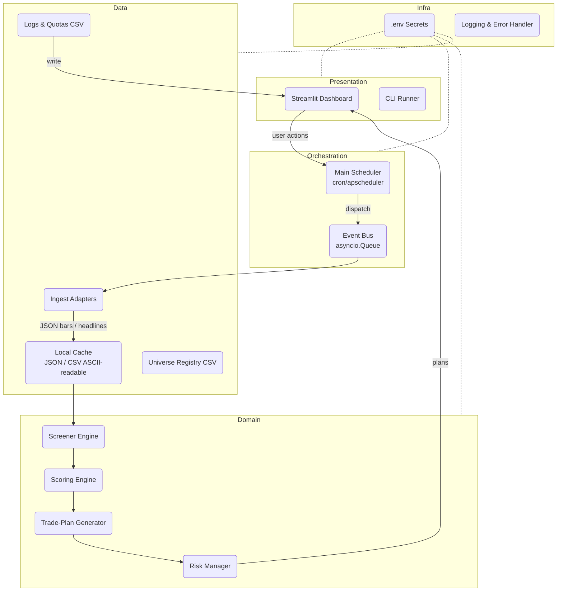

# Agent Architecture – One‑Day Trading Agent (Free‑Tier Edition)

*Last updated 2025‑06‑05*

---

## 1  Layered View



> **Key idea:** isolate external‑API chatter in **Data layer**, keep trading logic pure in **Domain layer**, and surface everything via Streamlit.

---

## 2  Core Components & Responsibilities

| Layer             | Module         | Key Classes / Functions                                      | Responsibilities                                                                                   |
| ----------------- | -------------- | ------------------------------------------------------------ | -------------------------------------------------------------------------------------------------- |
| **Infra**         | `settings.py`  | `Config` dataclass                                           | Loads secrets (.env), static constants, paths.                                                     |
|                   | `logger.py`    | `setup_logger()`                                             | Unified structured logging + console color codes.                                                  |
| **Data**          | `ingest.py`    | `FinnhubWS`, `AVClient`, `YFClient`, `QuotaGuard` | Fetch quotes (live), historical bars, manage fallback & quota stats.                               |
|                   | `news.py`      | `GdeltClient`, `NewsApiClient`, `SentimentAnalyzer` (VADER)  | Pull headlines, compute polarity score.                                                            |
|                   | `cache.py`     | `CacheStore`                                                 | Read/Write JSON ↔ SQLite for bar & news responses.                                                 |
| **Domain**        | `screener.py`  | `GapScanner`, `LiquidityFilter`                              | Narrow universe to volatile liquid names.                                                          |
|                   | `scoring.py`   | `FactorModel`                                                | Combine volatility, catalyst, sentiment, liquidity into weighted score.                            |
|                   | `planner.py`   | `PlanBuilder`                                                | Calculate entry, stop, target, position size.                                                      |
|                   | `risk.py`      | `ComplianceGuard`                                            | Enforce PRIIPs/KID & risk caps (€33).                                                              |
| **Orchestration** | `main.py`      | `run_scan()`, `run_second_look()`                            | High‑level flows; pushes events to dashboard.                                                      |
|                   | `bus.py`       | `EventBus`                                                   | Async message passing to avoid tight coupling.                                                     |
| **Presentation**  | `dashboard.py` | `render_sidebar()`, `render_table()`, `render_charts()`      | Streamlit UI; shows quota badges, alerts, mini‑charts; manual “Refresh” and “Second Look” buttons. |

---

## 3  Data Flow – Daily Scan (14:00 CET)

1. **Scheduler** triggers `main.run_scan()`.
2. `Config` loads keys & paths. `QuotaGuard` resets daily counters.
3. `FinnhubWS` opens; streams pre‑market ticks for **universe CSV**.
4. When first 1‑min bar closes (14:01), **GapScanner** computes gap % vs prev‑close.
5. **LiquidityFilter** prunes to ADV ≥ €5 M.
6. `news.py` fetches top 3 headlines/ticker; **SentimentAnalyzer** returns VADER compound ∈ \[‑1,1].
7. `scoring.FactorModel` scores each candidate; selects **top 5** with projected ≥8 % intraday ATR range.
8. `planner.PlanBuilder` derives entry/stop/TP; applies **Risk Manager** to cap position size & check KID.
9. Plans pushed to **EventBus**; `dashboard.py` refreshes UI.
10. User may click a symbol → side panel reveals headlines & tone bar.
11. All API interactions log to `logs/quotas.csv`; each plan logged to `logs/trades.csv`.

### Fallback Logic

* If `FinnhubWS` quota >95 % used → close socket, switch to **yfinance** (15‑min delay) and tag output `DELAYED`.
* If `FinnhubWS` quota >95 % used → close socket, switch to **yfinance** (15‑min delay) and tag output `DELAYED`.
* Alerts recorded and surfaced in dashboard.

---

## 4  Concurrency & Quota Strategy

```text
asyncio + websockets
│
├─ IngestTask (FinnhubWS) ↔ QuotaGuard
├─ NewsTask (HTTP)        ↔ QuotaGuard
└─ CacheWriter            ↔ SQLite
```

* **Single event loop**; each API adapter has `@rate_limit` decorator checking `QuotaGuard`.
* Critical sections (cache writes) use `asyncio.Lock` to avoid SQLite race.

---

## 5  Configuration Matrix

| Setting            | Default | Notes                               |
| ------------------ | ------- | ----------------------------------- |
| `DAILY_LOSS_CAP`   | `33`    | Euros, enforced by `risk.py`.       |
| `MAX_POS_EUR`      | `250`   | Per symbol.                         |
| `SCAN_TIME`        | `14:00` | Cron‑driven; override via CLI flag. |
| `SECOND_LOOK_TIME` | Manual  | Button in UI; user‑initiated.       |
| `MIN_GAP_PCT`      | `4`     | Pre‑market gap threshold.           |
| `TARGET_PCT`       | `9`     | Middle of 8–10 % window.            |

All tunables live in **settings.py** for easy edits, and also in streamlit dashboard when the user is using it.

---

## 6  Extensibility Hooks

* **EU Universe** – Add `eu_universe.csv` and pass exchange param to `LiquidityFilter`.
* **Auto‑size** – Future RL agent can read `trades.csv` to adjust `MAX_POS_EUR`.
* **Order Staging** – Stub in `planner.py` for Revolut API call once public endpoints allow.

---

## 7  Testing & CI

* **Unit tests** – PyTest for each adapter & factor calculation.
* **Quota tests** – Mock server to ensure fallback paths activate correctly.
* **E2E smoke** – GitHub Actions (free) triggered on push; uses cached sample JSON.

---

## 8  Decisions Locked

* **Cache format:** Human‑readable JSON / CSV files (per‑day or per‑symbol) stored in `data/cache/`—easy to inspect with any text editor.
* **Factor weights:** Default (Vol 0.4 / Catalyst 0.3 / Liquidity 0.2 / Sentiment 0.1) but surfaced in the Streamlit sidebar so you can tweak and persist values per session.
* **Chart library:** Use **Plotly** for mini‑candlestick charts (interactive, easy to embed). Can switch to built‑in Streamlit charts later if needed.

With these choices finalized, we can advance to drafting **build\_plan.md** (implementation roadmap).

---

## 9  Project Folder Layout (MVP)

```
one_day_agent/
├─ data/
│  ├─ cache/                 # JSON / CSV caches per day
│  ├─ revolut_universe.csv   # US‑listed symbols tradable on Revolut
│  └─ eu_universe.csv        # (future) EU symbols
├─ logs/
│  ├─ quotas.csv             # Daily API‑usage stats
│  └─ trades.csv             # Trade journal (auto‑generated)
├─ src/
│  ├─ __init__.py
│  ├─ settings.py            # Config & secrets loader
│  ├─ logger.py              # Structured logging helpers
│  ├─ bus.py                 # Async event bus
│  ├─ ingest.py              # Market‑data adapters & QuotaGuard
│  ├─ news.py                # News & sentiment fetching
│  ├─ cache.py               # CacheStore utils
│  ├─ screener.py            # Gap & liquidity filters
│  ├─ scoring.py             # FactorModel weights
│  ├─ planner.py             # Entry/stop/target sizing
│  ├─ risk.py                # Compliance & loss‑cap checks
│  └─ main.py                # Orchestration (run_scan, second_look)
├─ dashboard.py              # Streamlit UI entry‑point
├─ tests/
│  ├─ test_ingest.py
│  ├─ test_scoring.py
│  └─ ...
├─ requirements.txt          # Streamlit, plotly, websockets, vaderSentiment …
└─ README.md                 # Setup & usage instructions
```

> *Note:* The CLI runner can be invoked via `python -m src.main --scan` for cron jobs, while `streamlit run dashboard.py` launches the interactive dashboard.
